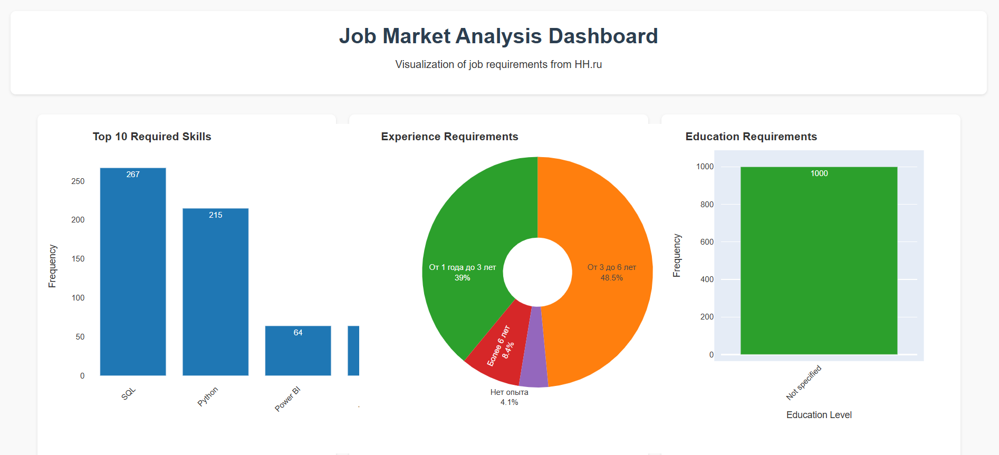

# DWV Bonus Assignment Report

## How to use

1. Download `Bonus.py`  
2. Run `pip install requests plotly`  
3. Run `python Bonus.py`  
4. Access gained data in `jobs.csv`  
5. Access visualization in `dashboard.html`  

Result should look like this:  

## Notes

- `jobs.csv` and `dashboard.html` are generated after code execution. They are not necessary to download but are included in the Git repository for illustration.  
- Code execution may take several dozen minutes due to time intervals between data requests.  
- Data is sourced from [hh.ru](https://hh.ru), filtered for "DATA ANALYST" positions in Moscow.  
- The data is in Russian as it was collected from a Russian resource.  

## EDA (Exploratory Data Analysis)

- The most frequently required skills are **SQL** and **Python**.  
- Nearly **90% of vacancies** require **1-6 years of experience**.  
- None of the analyzed vacancies specified a requirement for a particular educational background.  
